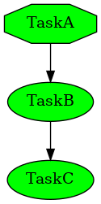
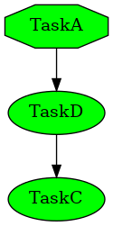

2.2 Core model
==============

2.2.1 Core settings
-------------------

Baelfire use `MorfDict <https://pythonhosted.org/MorfDict/>`_'s ``StringDict`` for settings and ``PathDict`` for path
configuration. All linked tasks have the same settings and paths object, so we can edit in the parent task if we want,
but this is not recomended. Better way is to make all the configuration in the Core object.

.. literalinclude:: code/doc4.py
    :language: python
    :caption: doc4.py
    :linenos:

.. code-block:: bash

    $ python doc4.py
    S my parent
    S /base/first.txt
    P my parent
    P /base/first.txt

We create 2 tasks and make settings for both of them. From Parent task we can
ovveride some settings within a child tasks.

2.2.2 Saving and loading settings
---------------------------------

Sometimes we would like to save settings, so it can be retrived from disk. For example, the name of the project we need
only at the start and we can retrive it from disk next time, but the rest of the configuration can be stored in python
code.

.. literalinclude:: code/doc11.py
    :language: python
    :caption: doc11.py
    :linenos:

.. code-block:: bash

    $ python doc11.py
    Description for something: testme
    testme
    $ python doc11.py
    testme
    $

2.2.3 Task replacment
---------------------

.. warning::
    This feature can result in very unreadable code. Use with caution! Use only as a last resort!

Creating task hierarchy can be very tricky. Sometimes we would like to change small thing in a task, but do not change
the rest of the hierarchy. Core object can replace one task class with another. In the next example we will have 3 tasks
depending on each other: TaskA, TaskB, TaskC. And then we will replace TaskB with TaskD.

Before:

After:

.. literalinclude:: code/doc13.py
    :language: python
    :caption: doc13.py
    :linenos:

.. code-block:: bash

    $ python doc13.py
    I am task A
    I am task B
    I am task C
    -------------
    I am task A
    I am task D
    I am task C

2.2.4 Task replacment - migration
---------------------------------

You can also make a migration script. If you would like to change something, or just to make more debug, like in the
example.

.. literalinclude:: code/doc14.py
    :language: python
    :caption: doc14.py
    :linenos:

.. code-block:: bash

    $ python doc14.py
    <__main__.TaskA object at 0x7f23af21bbe0> <class '__main__.TaskC'>
    I am task C
    I am task B
