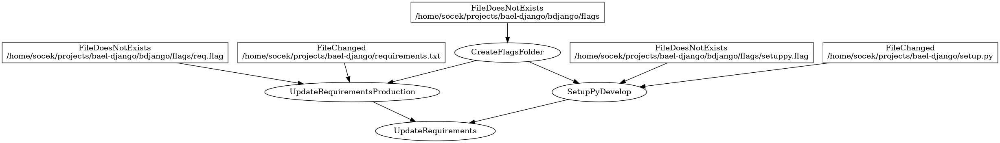
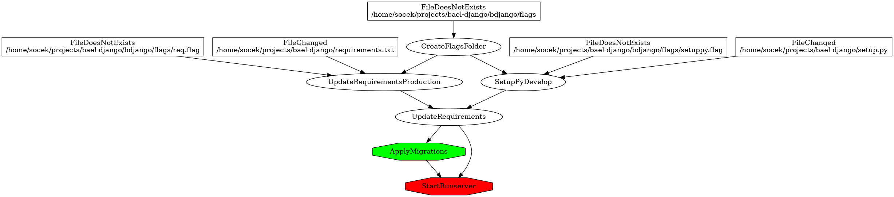
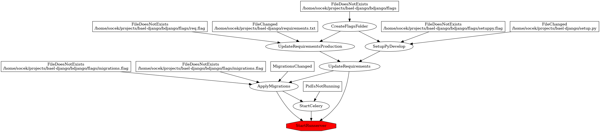
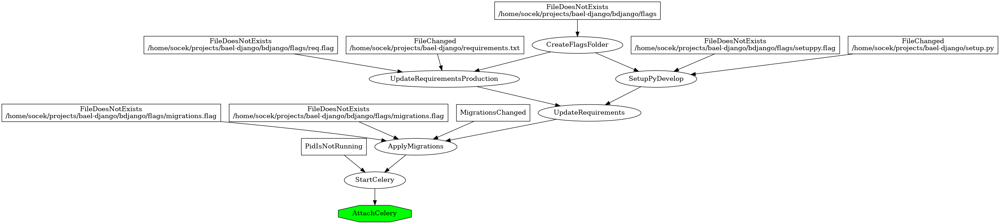

5.1 Django
==========

When we are implementing simple Django application and we want to start developer server (``runserver`` command), we
need to take care of few steps before using the server:

- update requiretments from setup.py or requiretments.txt
- apply migrations
- start celery
- start runserver

By using Baelfire, we can automate this process, so all these steps will be made before starting the runserver but only
when needed.

Code from this example is avalible here: https://github.com/socek/bael-django

5.1.1 Create the application
----------------------------

First of all, we need to create simple Django application for tests. It will not have any views, because all we want for
now is to make sure the runserver will start. We will not go into details here, because it is not a Django tutorial.
We will start with the setup.py file.

.. literalinclude:: django/setup-1.py
    :language: python
    :caption: setup.py
    :linenos:

I like to have simple makefile to create virtualenv and install first, so here it is:

.. literalinclude:: django/makefile-1
    :language: makefile
    :caption: Makefile
    :linenos:

Now we can run it and activate virtualenv.

.. literalinclude:: django/run-1

Now we can create our application and start ``runserver``.

.. literalinclude:: django/run-2

Our simple Django application is ready.

5.1.2 Baelfire package and first task
-------------------------------------

First step in creating automatizion is to create package that will be outside of the django app, which we have created a
moment ego.

.. literalinclude:: django/run-3

And the first task which will run ``python setup.py develop``

.. literalinclude:: django/tasks-1.py
    :language: python
    :caption: bdjango/tasks.py
    :linenos:

Now we can start our first task and see what it will do:

.. literalinclude:: django/run-4

Ok, but now we have hardcoded path for python executable and for setup.py. This will not work if we change our workdir.

.. literalinclude:: django/run-5

So now we will implement ``Core`` class and do some path configurations.

.. literalinclude:: django/core-1.py
    :language: python
    :caption: bdjango/core.py
    :linenos:

At line 9 we are setting the main project path. The rest of the paths are created depending on this main path. Now we
need to implement these settings in our task.

.. literalinclude:: django/tasks-2.py
    :language: python
    :caption: bdjango/tasks.py
    :linenos:

Last step for this paragraph is to make task with proper Core installed, so we need to create new file with an endpoint.

.. literalinclude:: django/cmd-1.py
    :language: python
    :caption: bdjango/cmd.py
    :linenos:

And now we can run it:

.. literalinclude:: django/run-6

5.1.3 First real dependency
---------------------------

So now we have a script, which will always run ``python setup.py develop``. But we need to run this only, when setup.py
has rebuilded. That is why we need to change the task implementation.

.. literalinclude:: django/tasks-3.py
    :language: python
    :caption: bdjango/tasks.py
    :linenos:

And also, we need to add some configurations to the core.

.. literalinclude:: django/core-2.py
    :language: python
    :caption: bdjango/core.py
    :linenos:

In this example, when we make update and we will not change the ``setup.py`` file, the script will not start the rebuild.
In those scripts we use ``bdjango/flags`` directory, as a place for storing the flags. You should create a folder before
running the ``bael`` application.

.. literalinclude:: django/run-7

5.1.4 Run Task in chain
-----------------------

If we can create a task for updating the requiretments, why not create a task for creating flags folder? It is very
simple to do that.

.. literalinclude:: django/tasks-4.py
    :language: python
    :caption: bdjango/tasks.py
    :linenos:

``CreateFlagsFolder`` is pretty simple. FileTask has a ``buildf_if(FileDoesNotExists(self.output))`` in the dependency
list, so we do not need to implement it. Also we added 1 more dependency in line 22, which indicates that the
``UpdateRequirements`` task will first run ``CreateFlagsFolder`` and rebuild itself if the ``CreateFlagsFolder`` has
rebuild.

.. literalinclude:: django/run-8

At this point, we have already created the flags folder by hand, that is why the first run did nothing. But after
removing the folder, the whole chain has been rebuild.

Most of the Python projects use requiretments.txt file instead of setup.py. In our sample project we will use both, just
for the sake of creating Baelfire tasks.

.. literalinclude:: django/tasks-5.py
    :language: python
    :caption: bdjango/tasks.py
    :linenos:

Our goal is to update ``setup.py develop`` and ``requiretments.txt`` in different tasks. I did not wanted to change
``cmd.py`` file, so I moved what we had in ``UpdateRequirements`` into ``SetupPyDevelop`` and created base class
``BaseRequirements`` in order to not repeat the same code for ``UpdateRequirementsProduction``. ``UpdateRequirements``
was created to link those two tasks, but it does not need to build anything.

Some changes needs to be done in the core file as well. Also, we have a new file: ``requiretments.txt``

.. literalinclude:: django/core-3.py
    :language: python
    :caption: bdjango/core.py
    :linenos:

.. literalinclude:: django/req-1.txt
    :caption: requirements.txt
    :linenos:

So now we can run our newly created baelfire tasks.

.. literalinclude:: django/run-9

5.1.5 Runserver
---------------

Main purpose of the Baelfire in our sample project is to start runserver with all the dependencies. For now, we have
implemented dependency of updating packages to proper version. It is enough to implement a task for starting the
developer's server.

.. literalinclude:: django/tasks-6.py
    :language: python
    :caption: bdjango/tasks.py
    :linenos:

The ``StartRunserver`` task has been implemented. In line 75 we have added ``AlwaysTrue`` dependency which will result in
rebuilding this task every time it will be started no matter the dependency checking.

Now we need to implement endpoint for starting new task.

.. literalinclude:: django/cmd-2.py
    :language: python
    :caption: bdjango/cmd.py
    :linenos:

No new settings needs to be done, so we will just test this run.

.. literalinclude:: django/run-10

As you can see on the listing above, running the runserver command will start reinstall requiretments before starting
the server application.

5.1.6 Migrations
----------------

You have probably noticed that runserver is yelling at us (color of the message is red, which means yelling!), that we
did not made migrations.

.. literalinclude:: django/tasks-7.py
    :language: python
    :caption: bdjango/tasks.py
    :linenos:

Now we have 2 tasks which needs to use ``manage.py``, so I made base class ``BaseManagePy`` with default dependency,
which make sure that the requiretments will be updated before running ``manage.py`` command. At this point we may want
to add ``AlwaysTrue`` dependency here, but it will be a design flaw. In the future, you may want to use ``manage.py``
command which does not need to be rebuild every time it will be started.

.. literalinclude:: django/run-11

Now, every time we will start runserver, we will run migrations before.

As you can see, we are using UpdateRequirements in two places, but the Baelfire does not complain and run it only once.

5.1.7 Custom dependency - migration
-----------------------------------

It is a good idea to rebuild migrations everytime we start the runserver, but it is a better idea to rebuild this only
when new migrations will be avalible. The task should search for newly created migration
scripts and then rebuild. If at this point you want to add some ifs in the ``build`` method, then stop it
please and read the whole documentation again. We will make custom dependency instead. This new dependency will search
thru all migration scripts and find the newest one. Then it will compare mtime of the file with the mtime of flag file.
This is how we will know if the migrations has been applied without connecting to the database. This algorythm is not
covering all of the situation that can happend, but for the sake of the example, let's just say it is enough.

.. literalinclude:: django/dependency-1.py
    :language: python
    :caption: bdjango/dependency.py
    :linenos:

The dependency is ready, so we can change our ``tasks.py`` and ``core.py``.

.. literalinclude:: django/tasks-8.py
    :language: python
    :caption: bdjango/dependency.py
    :linenos:

.. literalinclude:: django/core-6.py
    :language: python
    :caption: bdjango/dependency.py
    :linenos:

Now everytime we will start our ``runserver`` the migration will be started when needed.

.. literalinclude:: django/run-12

I did not include the code of the models which created the migration scripts. The whole code is avalible on github
(link above).

5.1.8 Tasks in the background - celery
--------------------------------------

Many projects needs to use task schedulers, which works outside of the webserver. For this tutorial we will use celery
`4.0.2`. For the simplicity, we don't care if the celery is connecting to the broker.

For the celery we could use normal task, but the downside is that we would need to run this in one terminal and the
runserver in second one. In most cases we would need the celery to be run, but not to be visible. We could start the
celery in the background, but sometimes we would like to see what is happening with the celery process. I prefer to use
screen for starting the celery process and attach/detach whenever I like. For this we will use ``ScreenTask`` and
``AttachScreenTask``.

.. literalinclude:: django/core-7.py
    :language: python
    :caption: bdjango/dependency.py
    :linenos:

We had to update ``core.py``, because Screen tasks needs to have ``exe:screen`` value in paths. Also we have added path
for celery pidfile.

.. literalinclude:: django/tasks-9.py
    :language: python
    :caption: bdjango/dependency.py
    :linenos:

In this file we have added ``StartCelery`` task, which will start celery worker in the background and ``AttachCelery``
for attaching the celery worker. ``StartRunserver`` also have a new dependency which will start celery before starting
``runserver``.

.. literalinclude:: django/cmd-3.py
    :language: python
    :caption: bdjango/cmd.py
    :linenos:

Here we only are adding endpoint for attaching the celery.

Starting ``runserver``:

Attaching ``celery``:

.. literalinclude:: django/run-13

5.1.9 Finally - your own command line
-------------------------------------

It is not very comfortable to use ``bael`` command for all this tasks. But it is very simple to make your own command
line tool. You can just inherite from ``baelfire.application.application.Application`` and make your own task names for
``-t`` switch.

.. literalinclude:: django/cmd-4.py
    :language: python
    :caption: bdjango/cmd.py
    :linenos:

Also you need to update ``setup.py`` file and run ``python setup.py develop`` in order to have new command line tool.

.. literalinclude:: django/setup-2.py
    :language: python
    :caption: bdjango/setup.py
    :linenos:

Finally, the quick and simple run:

.. literalinclude:: django/run-14
